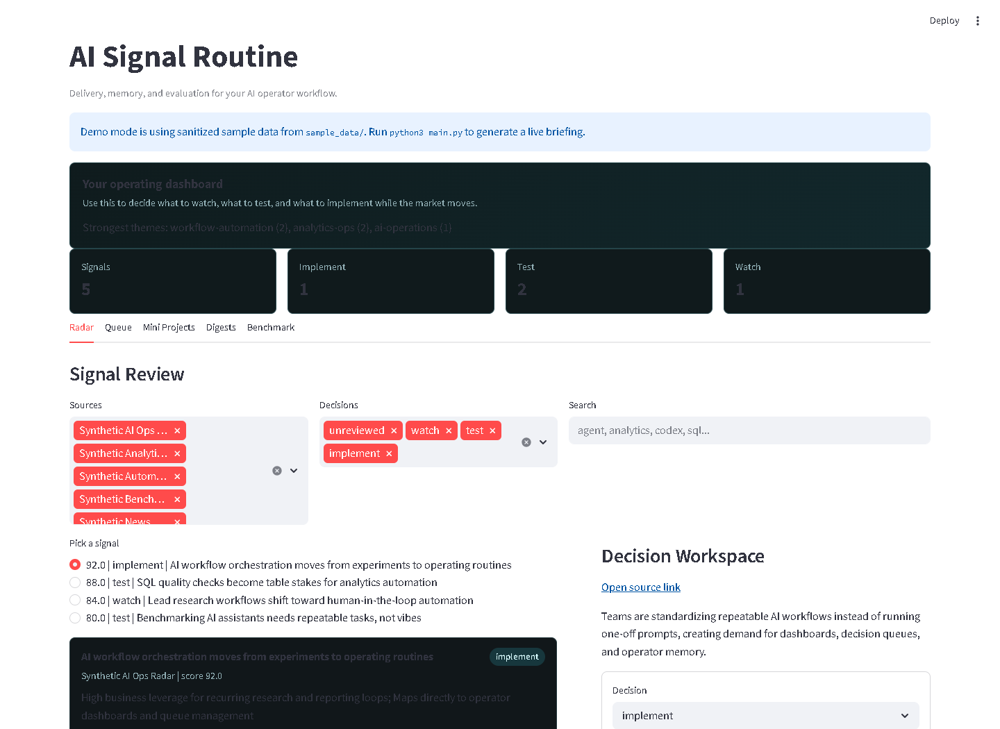
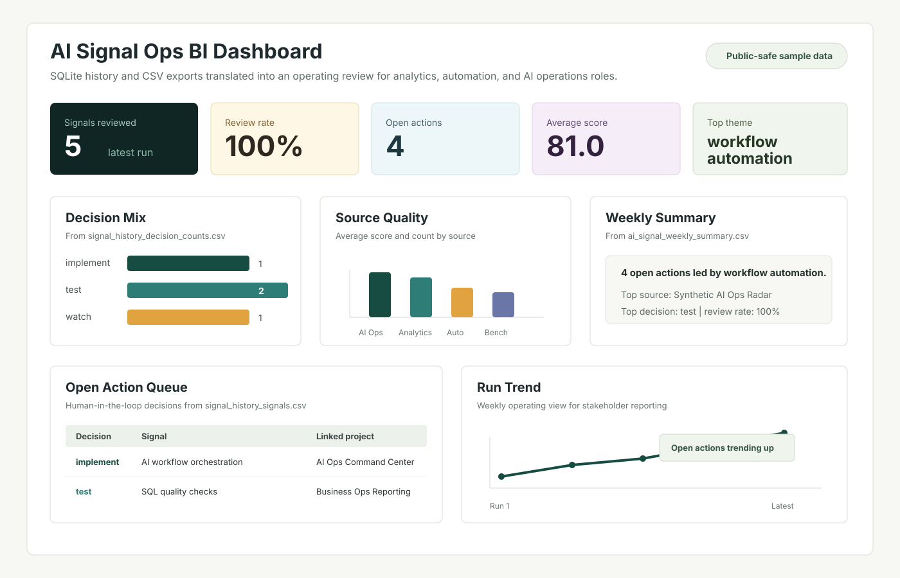

# AI Signal Routine

AI Signal Routine is a Python and Streamlit workflow for turning noisy AI, analytics, and automation updates into a ranked action queue.

The goal is not to read more AI news. The goal is to decide what is worth learning, testing, building with, monetizing, or ignoring.

## 30-Second Summary

This project monitors technical sources, scores each signal for career and business relevance, writes decision-ready briefings, records signal history in SQLite, and creates mini-project ideas from the strongest themes. It is built for an analytics and AI operations workflow: discover signals, filter hype, choose the next experiment, and keep a record of what deserves action.

## Visual Proof





Open the generated proof artifacts:

- [Latest briefing](reports/latest_briefing.md)
- [Sample briefing JSON](sample_data/sample_briefing.json)
- [Sample operator memory](sample_data/sample_operator_memory.json)
- [Analytics export guide](docs/analytics_export_guide.md)
- [BI export mockup](assets/screenshots/ai_signal_bi_export_mockup.svg)
- [Static briefing preview](assets/screenshots/ai_signal_briefing_preview.svg)
- [Benchmark tasks](benchmarks/benchmark_tasks.json)
- [Benchmark scorecard](benchmarks/benchmark_scorecard.md)
- [Results template](benchmarks/results_template.csv)
- [Operator playbook](docs/operator_playbook.md)
- [Roadmap: AI Ops Command Center](ROADMAP.md)

## What It Demonstrates

- Python automation for recurring research and reporting
- Signal scoring logic for AI, analytics, and workflow tooling
- SQLite history modeling for trend reporting and stale-action review
- Streamlit dashboarding for review, action tracking, and trend analysis
- Markdown/JSON/CSV report generation for decision briefs and analytics exports
- Stakeholder-ready weekly summary exports for Excel, Power BI, or operating reviews
- Memory layer for `watch`, `test`, `implement`, and `archive` decisions
- Benchmark workflow for comparing Claude and Codex on recurring tasks
- Business judgment around which AI tools create real leverage

## What It Does

The routine pulls from sources such as:

- official product and engineering blogs
- GitHub repository search and watchlists
- Hacker News discussions
- arXiv research feeds
- AI, analytics, and automation-focused sources configured in `config/sources.json`

Then it:

1. Scores each item by relevance, freshness, business value, learning value, and adoption signals.
2. Groups signals into themes such as coding agents, workflow automation, analytics AI, data science systems, and research radar.
3. Produces a ranked briefing in Markdown and JSON.
4. Writes signal history to SQLite for trend analysis.
5. Exports history tables to CSV for Excel, Power BI, or stakeholder reporting.
6. Generates a weekly summary CSV with review rate, action load, top source, top theme, and a plain-English summary.
7. Generates email and Slack-style digest files.
8. Maintains a lightweight memory file for decisions and next actions.
9. Creates mini-project prompts from the strongest signals.
10. Provides a Streamlit dashboard for reviewing the queue and trend history.

## System Flow

```text
Sources -> scoring -> ranked briefing -> dashboard review -> memory update -> next experiment
                         |                    |
                         |                    -> SQLite history -> trends / CSV exports
                         |                    -> weekly summary export
                         |                    -> benchmark tasks
                         -> email / Slack digest outputs
```

## Tech Stack

- Python
- Streamlit
- SQLite
- requests
- Markdown, JSON, and CSV report outputs
- GitHub/API-oriented source collection
- Local file-based memory and benchmark artifacts

## Quick Start

```bash
python3 -m venv .venv
source .venv/bin/activate
pip install -r requirements.txt
python3 main.py
```

A normal run writes the latest briefing, digest files, benchmark files, SQLite history database, and CSV history exports.

Run the dashboard with a generated briefing:

```bash
streamlit run dashboard.py
```

Run the public-safe demo without API keys or private local files:

```bash
AI_SIGNAL_SAMPLE_MODE=1 streamlit run dashboard.py
```

If `reports/latest_briefing.json` does not exist, the dashboard automatically falls back to the sanitized files in `sample_data/`.

Optional CLI controls:

- `python3 main.py --skip-history` skips SQLite and CSV history outputs.
- `python3 main.py --history-db data/custom_history.sqlite` writes history to a custom database path.
- `python3 main.py --history-export-dir reports/custom_history_exports` writes CSV exports to a custom folder.

Optional environment variables:

- `GITHUB_TOKEN` for higher GitHub API limits
- `SLACK_WEBHOOK_URL` if you want to wire digest delivery later
- `SMTP_HOST`, `SMTP_FROM`, and `SMTP_TO` if you want email delivery later

Do not commit local env files or API keys. Keep private settings in ignored local config files.

## Outputs

A normal run writes:

- `reports/latest_briefing.md`
- `reports/latest_briefing.json`
- `reports/latest_email_digest.md`
- `reports/latest_slack_digest.txt`
- `data/operator_memory.json`
- `data/signal_history.sqlite`
- `reports/history_exports/ai_signal_weekly_summary.csv`
- `reports/history_exports/signal_history_runs.csv`
- `reports/history_exports/signal_history_signals.csv`
- `reports/history_exports/signal_history_decision_counts.csv`
- `reports/history_exports/signal_history_source_counts.csv`
- `reports/history_exports/signal_history_themes.csv`
- `benchmarks/benchmark_tasks.json`
- `benchmarks/benchmark_scorecard.md`
- `benchmarks/results_template.csv`

The public-safe demo reads:

- `sample_data/sample_briefing.json`
- `sample_data/sample_operator_memory.json`

The public-safe demo writes generated local history to:

- `data/sample_signal_history.sqlite`

Generated SQLite databases and CSV export folders are ignored by git.

## Dashboard Workflow

The Streamlit dashboard helps you:

- review the highest-scoring signals
- inspect source, score, theme, and rationale
- label items as `watch`, `test`, `implement`, or `archive`
- capture notes and next actions
- review historical run trends from SQLite
- inspect a weekly summary table for stakeholder reporting
- inspect decision, source, theme, open-action, and stale-action tables
- export history tables and weekly summaries to CSV
- review generated mini-project ideas
- keep a repeatable loop for weekly experimentation

## SQLite Trend Layer

The history layer turns each briefing into analytics-ready tables:

- `briefing_runs` stores run-level metrics such as item count, review count, decision counts, top theme, and average score.
- `signals` stores each ranked signal with source, score, decision, priority, next action, linked project, tags, and theme hint.
- `theme_counts` stores theme distribution by run.
- `ai_signal_weekly_summary.csv` packages the history into a compact operating-review table with review rate, open actions, top theme, top source, and stakeholder summary.

The [analytics export guide](docs/analytics_export_guide.md) explains how to use these outputs in Excel, Power BI, Looker Studio, or an operating review.

This makes the project stronger for analytics and BI roles because the workflow now has durable data modeling, trend views, CSV exports, stale-action reporting, and a summary table that can feed Excel, Power BI, or an executive operating review.

## Public-Safe Sample Workflow

The sample data shows the workflow shape without exposing live research sources, tokens, local paths, or private notes:

1. A synthetic signal enters the briefing with score, source, tags, and rationale.
2. The operator memory layer labels it as `watch`, `test`, `implement`, or `archive`.
3. The dashboard turns those labels into an action queue.
4. The SQLite trend layer records the briefing for run history and exportable analytics.
5. The weekly summary export turns run history into a stakeholder-ready table.
6. Mini-project prompts connect the highest-value signals to portfolio builds.
7. Email and Slack-style digests convert the queue into stakeholder-ready summaries.

## Roadmap

The next version is the [AI Ops Command Center](ROADMAP.md): a public-safe dashboard that combines signal queue review, benchmark results, project backlog, automation opportunities, trend history, and a weekly executive brief.

Version 1 progress:

- Added sanitized sample briefing data.
- Added sanitized sample operator memory data.
- Added a demo path that works without private API keys.
- Added a real Streamlit dashboard screenshot from the sample workflow.

Version 3 progress:

- Added SQLite signal history storage.
- Added dashboard trend tables.
- Added CSV history exports.
- Added stale-action reporting foundation.
- Added stakeholder-ready weekly summary export.
- Added analytics export documentation for BI tools and operating reviews.
- Added a BI-style export mockup for analyst-facing portfolio polish.

## Portfolio Relevance

This project is aimed at AI operations and analytics automation roles. It shows that I can build a system that does more than summarize content: it creates a decision process around emerging tools, business value, implementation risk, next experiments, and historical reporting.

That makes it relevant to:

- AI Operations / AI Workflow Specialist roles
- Automation Analyst roles
- Data Analyst and BI Analyst roles with AI tooling exposure
- Solutions Engineering roles where technical research must become a clear recommendation

## Next Improvements

- Capture a fresh Trends tab screenshot from the public-safe sample workflow.
- Add richer trend deltas for source, category, recommendation, and stale actions.
- Promote stronger local automation extensions after private paths and machine-specific scripts are cleaned.

## Related Portfolio Projects

- [Business Operations Reporting System](https://github.com/Akannione/business-operations-reporting-system)
- [CRM Sales Pipeline Automation System](https://github.com/Akannione/crm-sales-pipeline-automation-system)
- [AlignDeskApp Demo](https://github.com/Akannione/aligndeskapp-demo)
