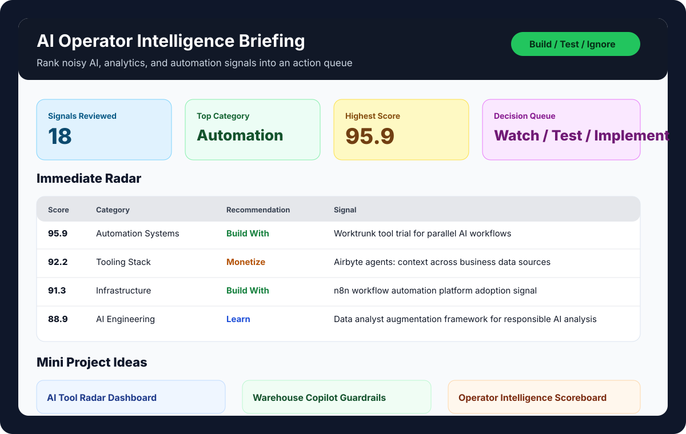

# AI Signal Routine

AI Signal Routine is a Python and Streamlit workflow for turning noisy AI, analytics, and automation updates into a ranked action queue.

The goal is not to read more AI news. The goal is to decide what is worth learning, testing, building with, monetizing, or ignoring.

## 30-Second Summary

This project monitors technical sources, scores each signal for career and business relevance, writes decision-ready briefings, and creates mini-project ideas from the strongest themes. It is built for an analytics and AI operations workflow: discover signals, filter hype, choose the next experiment, and keep a record of what deserves action.

## Visual Proof



Open the generated proof artifacts:

- [Latest briefing](reports/latest_briefing.md)
- [Benchmark tasks](benchmarks/benchmark_tasks.json)
- [Benchmark scorecard](benchmarks/benchmark_scorecard.md)
- [Results template](benchmarks/results_template.csv)
- [Operator playbook](docs/operator_playbook.md)

## What It Demonstrates

- Python automation for recurring research and reporting
- Signal scoring logic for AI, analytics, and workflow tooling
- Streamlit dashboarding for review and action tracking
- Markdown/JSON report generation for decision briefs
- Memory layer for `watch`, `test`, `implement`, and `archive` decisions
- Benchmark workflow for comparing Claude and Codex on recurring tasks
- Business judgment around which AI tools create real leverage

## What It Does

The routine pulls from sources such as:

- official product and engineering blogs
- GitHub repository search and watchlists
- Hacker News discussions
- arXiv research feeds
- AI, analytics, and automation-focused sources configured in `config/sources.json`

Then it:

1. Scores each item by relevance, freshness, business value, learning value, and adoption signals.
2. Groups signals into themes such as coding agents, workflow automation, analytics AI, data science systems, and research radar.
3. Produces a ranked briefing in Markdown and JSON.
4. Generates email and Slack-style digest files.
5. Maintains a lightweight memory file for decisions and next actions.
6. Creates mini-project prompts from the strongest signals.
7. Provides a Streamlit dashboard for reviewing the queue.

## System Flow

```text
Sources -> scoring -> ranked briefing -> dashboard review -> memory update -> next experiment
                         |                    |
                         |                    -> benchmark tasks
                         -> email / Slack digest outputs
```

## Tech Stack

- Python
- Streamlit
- requests
- Markdown and JSON report outputs
- GitHub/API-oriented source collection
- Local file-based memory and benchmark artifacts

## Quick Start

```bash
python3 -m venv .venv
source .venv/bin/activate
pip install -r requirements.txt
python3 main.py
```

Run the dashboard:

```bash
streamlit run dashboard.py
```

Optional environment variables:

- `GITHUB_TOKEN` for higher GitHub API limits
- `SLACK_WEBHOOK_URL` if you want to wire digest delivery later
- `SMTP_HOST`, `SMTP_FROM`, and `SMTP_TO` if you want email delivery later

Do not commit local env files or API keys. Keep private settings in ignored local config files.

## Outputs

A normal run writes:

- `reports/latest_briefing.md`
- `reports/latest_briefing.json`
- `reports/latest_email_digest.md`
- `reports/latest_slack_digest.txt`
- `data/operator_memory.json`
- `benchmarks/benchmark_tasks.json`
- `benchmarks/benchmark_scorecard.md`
- `benchmarks/results_template.csv`

## Dashboard Workflow

The Streamlit dashboard helps you:

- review the highest-scoring signals
- inspect source, score, theme, and rationale
- label items as `watch`, `test`, `implement`, or `archive`
- capture notes and next actions
- review generated mini-project ideas
- keep a repeatable loop for weekly experimentation

## Portfolio Relevance

This project is aimed at AI operations and analytics automation roles. It shows that I can build a system that does more than summarize content: it creates a decision process around emerging tools, business value, implementation risk, and next experiments.

That makes it relevant to:

- AI Operations / AI Workflow Specialist roles
- Automation Analyst roles
- Data Analyst and BI Analyst roles with AI tooling exposure
- Solutions Engineering roles where technical research must become a clear recommendation

## Next Improvements

- Add true Streamlit dashboard screenshots from a fresh public-safe run.
- Add a short walkthrough video.
- Rename the public repo to `ai-signal-routine` to remove the trailing hyphen.
- Add a Power BI or Looker-style export view for analyst-facing portfolio polish.
- Publish a sanitized sample briefing and operator memory file.
- Promote the stronger local WSL automation extensions after private paths and machine-specific scripts are cleaned.

## Related Portfolio Projects

- [Business Operations Reporting System](https://github.com/Akannione/business-operations-reporting-system)
- [CRM Sales Pipeline Automation System](https://github.com/Akannione/crm-sales-pipeline-automation-system)
- [AlignDeskApp Demo](https://github.com/Akannione/aligndeskapp-demo)
